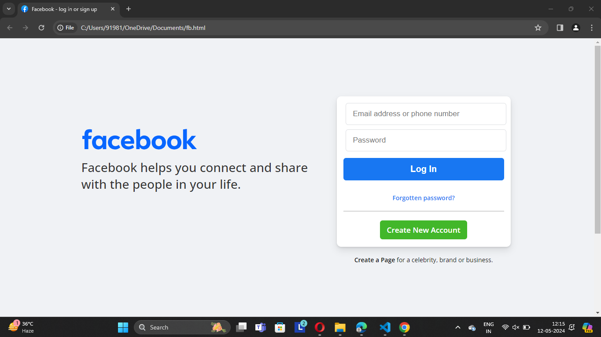
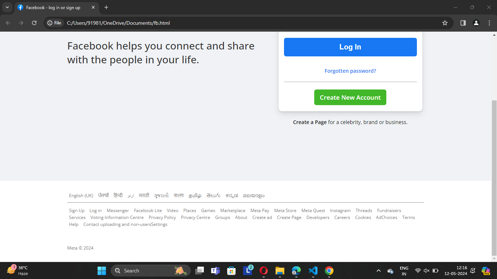

# Facebook Clone
This project is of Facebook's login/signup page's clone. It aims to replicate the basic functionality and design elements of Facebook's interface using HTML and CSS.

## Technologies Used
HTML: Used for structuring the page content.  
CSS: Used for styling and layout design.  
Font Awesome: Utilized for icons such as the Facebook logo.  

### HTML Structure:
The HTML provides the structure for a simplified version of Facebook's login/signup page.  
It includes elements such as containers, logos, input fields for email and password, login button, forgotten password link, and a link to create a new account.  
A footer section is added with language options and various links related to Facebook services and policies.  

### CSS Styling:
CSS styles are applied to elements to define their appearance and layout.  
Styles define the background color, font, size, and other visual aspects of the page elements.  
Selectors like .container, .left-content, .card, .login-btn, .Forgotten-password, .create-new-account, .create-a-page, .f-lg-footer, ul, li, a, and p are used to target specific elements and apply styling rules.  
Box shadow and border radius properties are used to give the card element a visually appealing look.  
Input fields and buttons have specific styling to enhance their appearance and usability.  

## Contributions
Contributions are welcome! If you have any suggestions or feature requests, feel free to open an issue or create a pull request.

### Output

 

